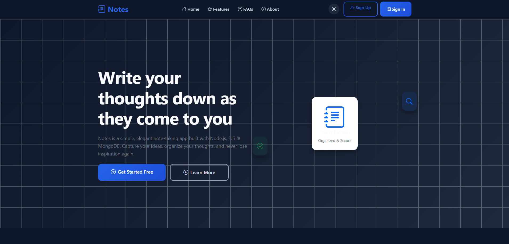
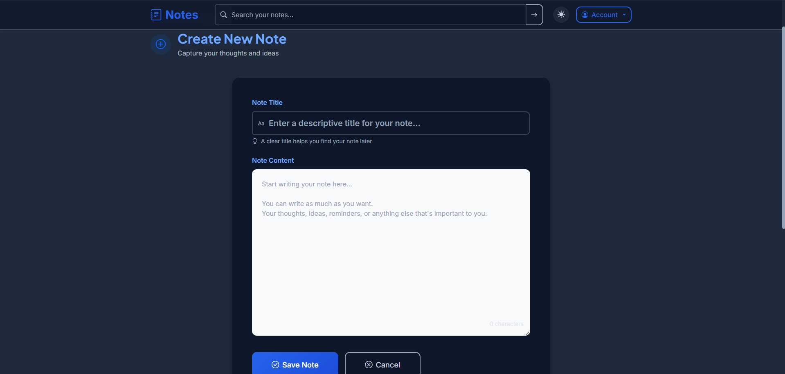
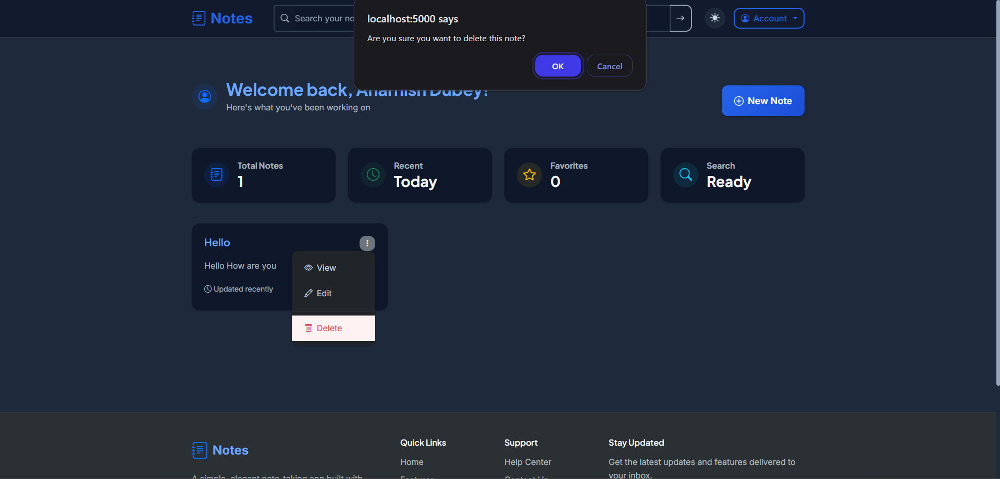

# Take-Notes Web App

A simple yet powerful web application for taking and saving notes with a clean interface built using EJS, JavaScript, CSS, and Node.js.

---

## Table of Contents

- [Features](#features)  
- [Demo](#demo)  
- [Screenshots](#screenshots)  
- [Tech Stack](#tech-stack)  
- [Getting Started](#getting-started)  
  - [Prerequisites](#prerequisites)  
  - [Installation](#installation)  
  - [Running the App](#running-the-app)  
- [Environment Variables](#environment-variables)  
- [Project Structure](#project-structure)  
- [Usage](#usage)  
- [Contributing](#contributing)  
- [License](#license)  
- [Contact](#contact)

---

## Features

- Create, view, and delete notes in a seamless user interface.  
- Minimal setup and intuitive navigation.  
- Uses server-side rendering with EJS templates.  
- Easily expandable and maintainable structure.

---

## Demo


**Demo Video:**  


---

## Screenshots

| Feature        | Screenshot |
|----------------|------------|
| Home Notes Page |  |
| Note Creation   |  |
| Note Deletion   |  |


---

## Tech Stack

- **Backend:** Node.js, Express.js  
- **Templating Engine:** EJS  
- **Frontend:** HTML, CSS, JavaScript  
- **Data Storage:** (e.g., In-memory, file-based—specify as needed)

---

## Getting Started

### Prerequisites

- [Node.js](https://nodejs.org/) (v14 or later recommended)  
- [npm](https://www.npmjs.com/) (comes with Node.js)

### Installation

```bash
git clone https://github.com/aharnish5/Take-Notes-Web-App.git
cd Take-Notes-Web-App
npm install
```

### Running the App

```bash
npm start
```

Then navigate to [http://localhost:3000](http://localhost:3000) in your browser.

---

## Environment Variables

This app uses the following environment variables (example in `.env`):

```
# .env-example
PORT=3000
DATA_FILE=notes.json
```

Copy this file to `.env` and adjust values as necessary.

---

## Project Structure

```
Take-Notes-Web-App/
├── app.js
├── views/
│   └── [Your EJS templates]
├── public/
│   └── [Static assets: CSS, JS]
├── .env-example
├── package.json
└── dummyData.txt
```

---

## Usage

1. Navigate to the home page.  
2. Add a new note using the provided form.  
3. Your notes will be listed below with options to delete.

---

## Contributing

Contributions are welcome! If you'd like to suggest new features or improvements:

1. Fork the repository  
2. Create a new branch (e.g., `feature/add-edit-notes`)  
3. Commit your changes and push to your branch  
4. Open a Pull Request and describe your changes

---

## Contact

For any questions or feedback, feel free to contact:

- **Author:** Aharnish Dubey  
- **GitHub:** [aharnish5](https://github.com/aharnish5)  

---
